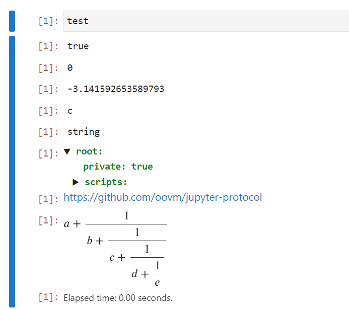
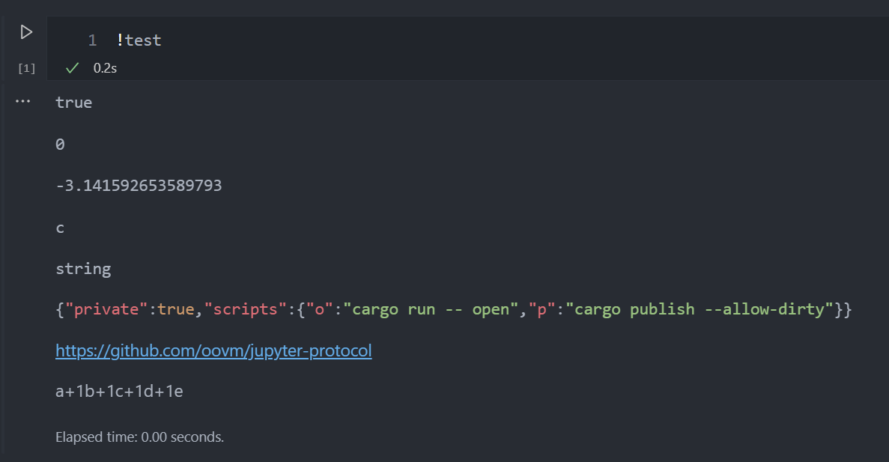

Jupyter Kernel Protocol in Rust
===============================

Just implement the following clap application, and then execute `<BIN> install` to get a jupyter kernel of the corresponding language.

```rust
#[derive(Parser)]
#[command(author, version, about, long_about = None)]
pub struct JupyterApplication {
    #[arg(short, long, value_name = "FILE")]
    config: Option<PathBuf>,
    #[arg(short, long, action = clap::ArgAction::Count)]
    debug: u8,
    #[command(subcommand)]
    command: JupyterCommands,
}

#[derive(Subcommand)]
enum JupyterCommands {
    Open(Box<OpenAction>),
    Start(Box<StartAction>),
    Install(Box<InstallAction>),
    Uninstall(Box<UninstallAction>),
}
```

- See more usages in example: [jupyter-calculator](./projects/jupyter-calculator/src/lib.rs)

Supports jupyter lab and vscode





## Known Issues

- Can't render math formula in vscode
- Can't send debug info reply to DAP client

## Related Projects

- Document: [Jupyter Kernel Protocol](https://jupyter-client.readthedocs.io/en/stable/messaging.html)
- [Clap](https://github.com/clap-rs/clap), Used to build command line interface
- Especially Thanks to [EVCXR](https://github.com/evcxr/evcxr) for `ZmdMessage` decode